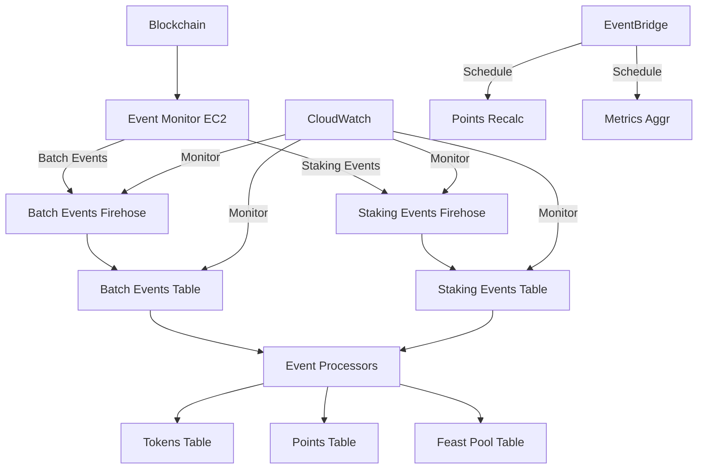

# Event Processing Architecture v2

## Overview
This document outlines the updated event processing architecture for the NGU Points System, utilizing Kinesis Firehose for direct event ingestion into DynamoDB.

## Architecture Diagram


## Event Types

### Batch Events
Events that affect multiple tokens at once.

```typescript
interface BatchEvent {
    id: string;            // `${blockNumber}-${txHash}-${logIndex}`
    type: 'BatchMint' | 'BatchBurn' | 'BatchTransfer';
    startTokenId: number;  // First token ID in range
    quantity: number;      // Number of tokens affected
    from?: string;        // Source address (for burn/transfer)
    to: string;          // Destination address (for mint/transfer)
    timestamp: number;    // Block timestamp
    blockNumber: number;  // Block number
    transactionHash: string; // Transaction hash
    transactionIndex: number; // Index in block
    logIndex: string;    // Log index in transaction
    processed: boolean;   // Processing status
    processedAt?: number; // When processing completed
    error?: string;      // Error message if failed
    ttl: number;        // Record TTL (7 days)
}
```

### Staking Events
Events that affect individual token staking status.

```typescript
interface StakingEvent {
    id: string;            // `${blockNumber}-${txHash}-${logIndex}`
    type: 'Stake' | 'Unstake';
    tokenId: number;      // Token being staked/unstaked
    staker: string;       // Staker address
    timestamp: number;    // Block timestamp
    blockNumber: number;  // Block number
    transactionHash: string; // Transaction hash
    transactionIndex: number; // Index in block
    logIndex: string;    // Log index in transaction
    processed: boolean;   // Processing status
    processedAt?: number; // When processing completed
    error?: string;      // Error message if failed
    ttl: number;        // Record TTL (7 days)
}
```

## Infrastructure Components

### 1. Kinesis Firehose Delivery Streams

#### Batch Events Firehose
- Name: `${service}-batch-events-${stage}`
- Destination: BatchEventsTable
- Buffer Size: 1 MB
- Buffer Interval: 60 seconds
- Error Handling: Dead Letter Queue
- Monitoring: CloudWatch metrics and alarms

#### Staking Events Firehose
- Name: `${service}-staking-events-${stage}`
- Destination: StakingEventsTable
- Buffer Size: 1 MB
- Buffer Interval: 60 seconds
- Error Handling: Dead Letter Queue
- Monitoring: CloudWatch metrics and alarms

### 2. DynamoDB Tables

#### Batch Events Table
- Table Name: `${service}-batch-events-${stage}`
- Primary Key: id (string)
- GSI: TypeBlockIndex
  - PK: type
  - SK: blockNumber
- TTL: 7 days
- Capacity: On-demand

#### Staking Events Table
- Table Name: `${service}-staking-events-${stage}`
- Primary Key: id (string)
- GSI: StakerTokenIndex
  - PK: staker
  - SK: tokenId
- TTL: 7 days
- Capacity: On-demand

### 3. Event Monitor
- Runs on EC2
- Parses blockchain events
- Routes events to appropriate Firehose
- Monitors event processing health
- Reports metrics to CloudWatch

## Event Flow

### 1. Event Detection
1. Event Monitor detects blockchain event
2. Determines event type (Batch or Staking)
3. Formats event according to schema
4. Routes to appropriate Firehose

### 2. Event Ingestion
1. Firehose buffers events
2. Automatically retries failed writes
3. Reports metrics to CloudWatch
4. Writes to appropriate DynamoDB table

### 3. Event Processing
1. Lambda processors scan for unprocessed events
2. Process events in order by block number
3. Update token and points tables
4. Mark events as processed

## Monitoring and Alerting

### CloudWatch Metrics
1. **Firehose Metrics**
   - IncomingRecords
   - DeliveryToDynamoDB.Records
   - DeliveryToDynamoDB.Success
   - ThrottledRecords

2. **DynamoDB Metrics**
   - SuccessfulRequestLatency
   - ThrottledRequests
   - ConsumedWriteCapacityUnits

### CloudWatch Alarms
1. **Critical Alarms**
   - Firehose delivery delay > 15 minutes
   - DynamoDB throttling > 10%
   - Failed record count > 1%

2. **Warning Alarms**
   - Firehose buffer utilization > 80%
   - DynamoDB consumed capacity > 80%
   - Event processing delay > 5 minutes

## Cost Optimization

### Firehose Configuration
- Buffer optimization to minimize DynamoDB writes
- Compression enabled for all streams
- Error retry with exponential backoff

### DynamoDB Configuration
- On-demand capacity for cost efficiency
- TTL enabled to automatically remove old records
- GSIs designed for efficient querying

## Security

### IAM Roles and Policies
1. **Firehose Role**
   - Write access to DynamoDB
   - CloudWatch logs access
   - Minimal permissions principle

2. **Event Monitor Role**
   - Write access to Firehose
   - CloudWatch metrics access
   - Systems Manager access

### Network Security
- VPC endpoints for AWS services
- Private subnets for EC2 instances
- Security groups with minimal access

## Deployment Considerations

### Dependencies
1. **AWS Services**
   - Kinesis Firehose
   - DynamoDB
   - CloudWatch
   - EventBridge
   - EC2

2. **VPC Requirements**
   - Private subnets
   - NAT Gateway
   - VPC Endpoints

### Environment Variables
```typescript
interface EnvConfig {
    NODE_ENV: 'prod' | 'staging';
    AWS_REGION: string;
    BATCH_FIREHOSE_NAME: string;
    STAKING_FIREHOSE_NAME: string;
    BATCH_EVENTS_TABLE: string;
    STAKING_EVENTS_TABLE: string;
    ERROR_SNS_TOPIC: string;
    LOG_LEVEL: 'debug' | 'info' | 'warn' | 'error';
}
```

## Testing Strategy

### Unit Tests
1. Event parsing and validation
2. Firehose record formatting
3. Error handling and retry logic

### Integration Tests
1. End-to-end event flow
2. Firehose delivery verification
3. DynamoDB write confirmation

### Load Tests
1. High volume event handling
2. Firehose buffering behavior
3. DynamoDB scaling response

## Recovery Procedures

### Event Loss Recovery
1. Identify missing block range
2. Replay events from blockchain
3. Verify event processing
4. Update monitoring metrics

### Processing Delay Recovery
1. Scale up resources if needed
2. Clear event backlog
3. Verify event ordering
4. Update processing metrics

## Future Improvements

1. **Enhanced Monitoring**
   - Custom CloudWatch dashboard
   - Real-time event processing metrics
   - Automated scaling triggers

2. **Optimization Opportunities**
   - Firehose buffer tuning
   - DynamoDB capacity optimization
   - Processing parallelization

3. **Additional Features**
   - Event replay capability
   - Historical data analysis
   - Real-time analytics 