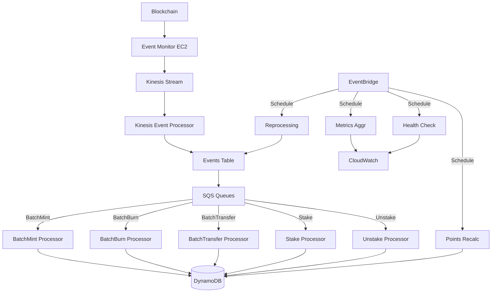

# Lambda Functions Specification

## Overview

This document outlines the Lambda functions required for the NGU Points System event processing pipeline. The system processes blockchain events through a series of Lambda functions, each with specific responsibilities in the event processing lifecycle.

## Architecture



## Data Models

### Event Record
```typescript
interface EventRecord {
  // Primary key for Events table
  id: string;            // Format: `${blockNumber}-${txHash}-${logIndex}`
  
  // Event metadata
  eventType: EventType;  // GSI for event type lookups
  timestamp: number;     // Block timestamp
  blockNumber: number;   // For ordering/tracking
  transactionHash: string; // For deduplication/tracking
  logIndex: number;      // For ordering within transaction
  
  // Event data
  from?: string;         // Optional sender address (lowercase)
  to: string;           // Recipient address (lowercase)
  startId: number;      // First NFT ID in range
  range: number;        // Number of NFTs in range
  
  // Processing metadata
  processed: boolean;    // Processing status
  processedAt?: number; // Processing timestamp
  retryCount?: number;  // Failed processing attempts
  error?: string;       // Error message if failed
  ttl: number;         // TTL for event record (7 days)
}

enum EventType {
  BatchMint = 'BatchMint',
  BatchBurn = 'BatchBurn',
  BatchTransfer = 'BatchTransfer',
  Stake = 'Stake',
  Unstake = 'Unstake'
}
```

### Token Record
```typescript
interface TokenRecord {
  // Primary key for Tokens table
  id: number;           // Token ID
  
  // Token data
  owner: string;        // Current owner address
  staked: boolean;      // Staking status
  mintedAt: number;     // Minting timestamp
  mintTx: string;       // Minting transaction hash
  lastUpdateAt: number; // Last modification timestamp
  
  // Optional metadata
  lastTransferTx?: string;  // Last transfer transaction
  stakeTx?: string;        // Current stake transaction
  unstakeTx?: string;      // Last unstake transaction
}
```

### Points Record
```typescript
interface PointsRecord {
  // Primary key for Points table
  address: string;      // User address
  
  // Points data
  points: number;       // Total points
  dailyPoints: number;  // Points for current day
  lastUpdateAt: number; // Last modification timestamp
  
  // Staking data
  stakedTokens: number[];  // Array of staked token IDs
  lastStakeAt?: number;   // Last stake timestamp
  lastUnstakeAt?: number; // Last unstake timestamp
  
  // Statistics
  totalStaked: number;    // Total tokens ever staked
  currentStaked: number;  // Currently staked tokens
  stakingStreak: number;  // Consecutive days staking
}
```

## Lambda Functions

### 1. Kinesis Event Processor

**Purpose**: 
- Processes raw blockchain events from Kinesis stream
- Validates and normalizes event data
- Stores events in Events table for processing
- Routes events to appropriate SQS queues for processing
- Ensures event ordering and deduplication

**Inputs**:
```typescript
interface KinesisEvent {
  Records: {
    kinesis: {
      data: string; // Base64 encoded event data
      partitionKey: string;
      sequenceNumber: string;
    };
    eventID: string;
    eventName: string;
    eventVersion: string;
    eventSource: string;
    awsRegion: string;
  }[];
}

// Decoded event data shape
interface BlockchainEvent {
  type: EventType;
  from?: string;
  to: string;
  startId: number;
  range: number;
  timestamp: number;
  blockNumber: number;
  transactionHash: string;
  logIndex: number;
}
```

**Outputs**:
1. Events Table Record:
```typescript
interface EventRecord {
  id: string;
  eventType: EventType;
  timestamp: number;
  blockNumber: number;
  transactionHash: string;
  logIndex: number;
  from?: string;
  to: string;
  startId: number;
  range: number;
  processed: boolean;
  ttl: number;
}
```

2. SQS Message:
```typescript
interface SQSMessage {
  eventId: string;
  eventType: EventType;
  timestamp: number;
}
```

**Configuration**:
```typescript
{
  memorySize: 256,
  timeout: 30,
  batchSize: 100,
  retryAttempts: 3,
  concurrency: 10,
  environment: {
    EVENTS_TABLE: string,
    EVENT_QUEUE_URL: string,
    NODE_ENV: string
  }
}
```

### 2. Event Type Processors

#### a. BatchMint Processor

**Purpose**:
- Processes BatchMint events from SQS
- Creates new token records in Tokens table
- Initializes token ownership
- Updates points for minting if applicable
- Ensures atomic updates across tables

**Inputs**:
```typescript
interface SQSEvent {
  Records: {
    messageId: string;
    body: string; // JSON stringified BatchMintEvent
    attributes: {
      ApproximateReceiveCount: string;
      SentTimestamp: string;
      SenderId: string;
      ApproximateFirstReceiveTimestamp: string;
    };
  }[];
}

interface BatchMintEvent {
  id: string;
  to: string;
  startId: number;
  range: number;
  timestamp: number;
  transactionHash: string;
}
```

**Outputs**:
1. Token Records:
```typescript
interface TokenRecord {
  id: number;
  owner: string;
  staked: boolean;
  mintedAt: number;
  mintTx: string;
  lastUpdateAt: number;
}
```

2. Event Update:
```typescript
interface EventUpdate {
  id: string;
  processed: boolean;
  processedAt: number;
}
```

#### b. BatchBurn Processor

**Purpose**:
- Processes BatchBurn events from SQS
- Validates token ownership before burning
- Removes token records from Tokens table
- Updates points if tokens were staked
- Maintains points consistency

**Inputs**:
```typescript
interface BatchBurnEvent {
  id: string;
  from: string;
  startId: number;
  range: number;
  timestamp: number;
  transactionHash: string;
}
```

**Outputs**:
1. Token Deletions:
```typescript
interface TokenDeletion {
  id: number;
  owner: string;
  wasStaked: boolean;
}
```

2. Points Updates (if tokens were staked):
```typescript
interface PointsUpdate {
  address: string;
  pointsChange: number;
  stakedTokensRemoved: number[];
}
```

#### c. BatchTransfer Processor

**Purpose**:
- Processes BatchTransfer events from SQS
- Validates current token ownership
- Updates token ownership records
- Handles points transfers for staked tokens
- Maintains consistency between tokens and points

**Inputs**:
```typescript
interface BatchTransferEvent {
  id: string;
  from: string;
  to: string;
  startId: number;
  range: number;
  timestamp: number;
  transactionHash: string;
}
```

**Outputs**:
1. Token Updates:
```typescript
interface TokenOwnershipUpdate {
  id: number;
  previousOwner: string;
  newOwner: string;
  staked: boolean;
  lastTransferTx: string;
  lastUpdateAt: number;
}
```

2. Points Updates (if tokens were staked):
```typescript
interface StakingTransferUpdate {
  fromAddress: string;
  toAddress: string;
  tokenIds: number[];
  pointsTransferred: number;
}
```

#### d. Stake Processor

**Purpose**:
- Processes Stake events from SQS
- Validates token ownership and stake eligibility
- Updates token staking status
- Calculates and updates user points
- Maintains staking statistics

**Inputs**:
```typescript
interface StakeEvent {
  id: string;
  account: string;
  tokenId: number;
  timestamp: number;
  transactionHash: string;
}
```

**Outputs**:
1. Token Update:
```typescript
interface TokenStakeUpdate {
  id: number;
  staked: boolean;
  stakeTx: string;
  lastUpdateAt: number;
}
```

2. Points Update:
```typescript
interface StakingPointsUpdate {
  address: string;
  newPoints: number;
  stakedTokens: number[];
  stakingStreak: number;
  lastStakeAt: number;
}
```

#### e. Unstake Processor

**Purpose**:
- Processes Unstake events from SQS
- Validates token staking status
- Updates token staking records
- Recalculates user points
- Updates staking statistics

**Inputs**:
```typescript
interface UnstakeEvent {
  id: string;
  account: string;
  tokenId: number;
  timestamp: number;
  transactionHash: string;
}
```

**Outputs**:
1. Token Update:
```typescript
interface TokenUnstakeUpdate {
  id: number;
  staked: boolean;
  unstakeTx: string;
  lastUpdateAt: number;
}
```

2. Points Update:
```typescript
interface UnstakingPointsUpdate {
  address: string;
  updatedPoints: number;
  removedTokenId: number;
  stakingStreak: number;
  lastUnstakeAt: number;
}
```

### 3. Maintenance Lambdas

#### a. Event Reprocessing Lambda

**Purpose**:
- Identifies and reprocesses failed events
- Manages retry attempts and backoff
- Updates event processing metadata
- Generates reprocessing metrics

**Inputs**:
```typescript
interface EventBridgeEvent {
  time: string;
  source: string;
  resources: string[];
}
```

**Outputs**:
1. Failed Events Report:
```typescript
interface ReprocessingReport {
  eventsFound: number;
  eventsRequeued: number;
  eventsFailed: number;
  retryStats: {
    attempt1: number;
    attempt2: number;
    attempt3: number;
    maxRetries: number;
  };
}
```

2. CloudWatch Metrics:
```typescript
interface ReprocessingMetrics {
  failedEvents: number;
  reprocessingLatency: number;
  successRate: number;
}
```

#### b. Points Recalculation Lambda

**Purpose**:
- Performs daily points reset at UTC midnight
- Validates points calculations
- Updates leaderboard indexes
- Generates points statistics

**Schedule**: Daily at 00:00 UTC

**Inputs**:
```typescript
interface ScheduledEvent {
  time: string;
  region: string;
}
```

**Outputs**:
1. Points Summary:
```typescript
interface PointsRecalcSummary {
  totalPoints: number;
  activeStakers: number;
  topStakers: Array<{
    address: string;
    points: number;
  }>;
  dailyStats: {
    pointsAwarded: number;
    uniqueStakers: number;
    averagePoints: number;
  };
}
```

#### c. Metrics Aggregation Lambda

**Purpose**:
- Aggregates system-wide metrics
- Calculates performance statistics
- Updates CloudWatch metrics
- Generates operational reports

**Schedule**: Every 5 minutes

**Inputs**:
```typescript
interface MetricsEvent {
  timestamp: number;
  window: {
    start: number;
    end: number;
  };
}
```

**Outputs**:
1. System Metrics:
```typescript
interface SystemMetrics {
  eventProcessing: {
    totalEvents: number;
    avgLatency: number;
    errorRate: number;
  };
  tokenOperations: {
    mints: number;
    burns: number;
    transfers: number;
    stakes: number;
  };
  pointsSystem: {
    totalPoints: number;
    activeStakers: number;
    stakingRate: number;
  };
}
```

#### d. Health Check Lambda

**Purpose**:
- Monitors system health
- Validates data consistency
- Detects processing delays
- Triggers alerts for issues

**Schedule**: Every minute

**Inputs**:
```typescript
interface HealthCheckEvent {
  timestamp: number;
}
```

**Outputs**:
1. Health Status:
```typescript
interface HealthStatus {
  status: 'healthy' | 'degraded' | 'unhealthy';
  components: {
    kinesis: ComponentHealth;
    eventProcessor: ComponentHealth;
    sqsQueues: ComponentHealth;
    dynamoDB: ComponentHealth;
  };
  metrics: {
    processingLatency: number;
    queueDepth: number;
    errorRate: number;
  };
  alerts: Alert[];
}

interface ComponentHealth {
  status: 'healthy' | 'degraded' | 'unhealthy';
  lastCheck: number;
  message?: string;
}

interface Alert {
  severity: 'critical' | 'warning' | 'info';
  message: string;
  timestamp: number;
}
```

## Error Handling

### Retry Policies
1. **Kinesis Events**: 
   - Maximum 3 retries
   - Exponential backoff
   - Dead letter queue after max retries

2. **SQS Events**:
   - Maximum 5 retries
   - 5-minute visibility timeout
   - Dead letter queue after max retries

3. **Maintenance Tasks**:
   - Maximum 2 retries
   - Linear backoff
   - Alert on failure

### Error Types
```typescript
enum ErrorType {
  // Retriable errors
  NETWORK_ERROR = 'NETWORK_ERROR',
  THROTTLING = 'THROTTLING',
  TIMEOUT = 'TIMEOUT',
  
  // Non-retriable errors
  VALIDATION_ERROR = 'VALIDATION_ERROR',
  DUPLICATE_EVENT = 'DUPLICATE_EVENT',
  INVALID_STATE = 'INVALID_STATE'
}
```

## Monitoring

### CloudWatch Metrics
1. **Event Processing**:
   - EventsProcessed
   - ProcessingLatency
   - ErrorCount
   - RetryCount

2. **Token Operations**:
   - TokensMinted
   - TokensBurned
   - TokensTransferred
   - TokensStaked

3. **Points System**:
   - TotalPoints
   - DailyPoints
   - ActiveStakers
   - StakingRate

### Alarms
1. **Critical Alarms** (Page on-call):
   - Processing latency > 5 minutes
   - Error rate > 5%
   - Failed health check
   - Stuck events detected

2. **Warning Alarms** (Slack notification):
   - Processing latency > 1 minute
   - Retry rate > 10%
   - High memory usage
   - Elevated error rate

## Cost Optimization

### Lambda Configuration
1. **Memory Allocation**:
   - Event Processor: 256MB
   - Type Processors: 512MB
   - Maintenance: 128MB

2. **Timeout Settings**:
   - Event Processor: 30s
   - Type Processors: 60s
   - Maintenance: 300s

3. **Batch Processing**:
   - Kinesis: 100 records
   - SQS: 10 records
   - Maintenance: As needed

### DynamoDB Usage
1. **Events Table**:
   - TTL enabled (7 days)
   - On-demand capacity
   - GSI for event type queries

2. **Tokens Table**:
   - No TTL
   - On-demand capacity
   - GSI for owner queries

3. **Points Table**:
   - No TTL
   - On-demand capacity
   - GSIs for leaderboards

## Deployment

### Dependencies
1. **AWS Services**:
   - DynamoDB
   - Kinesis
   - SQS
   - EventBridge
   - CloudWatch

2. **IAM Roles**:
   - Event processor role
   - Type processor roles
   - Maintenance roles

3. **VPC Requirements**:
   - Private subnets
   - NAT Gateway
   - Security groups

### Environment Variables
```typescript
interface EnvConfig {
  NODE_ENV: 'prod' | 'staging';
  AWS_REGION: string;
  KINESIS_STREAM_NAME: string;
  EVENTS_TABLE: string;
  TOKENS_TABLE: string;
  POINTS_TABLE: string;
  ERROR_SNS_TOPIC: string;
  LOG_LEVEL: 'debug' | 'info' | 'warn' | 'error';
}
```

## Testing

### Unit Tests
1. **Event Processing**:
   - Event validation
   - Data transformation
   - Error handling

2. **Business Logic**:
   - Points calculation
   - Token operations
   - State transitions

3. **Utilities**:
   - Retry logic
   - Error classification
   - Metric generation

### Integration Tests
1. **Event Flow**:
   - End-to-end processing
   - Error recovery
   - State consistency

2. **Performance**:
   - Latency measurements
   - Throughput testing
   - Resource utilization

3. **Resilience**:
   - Failure injection
   - Recovery testing
   - Partial outages 